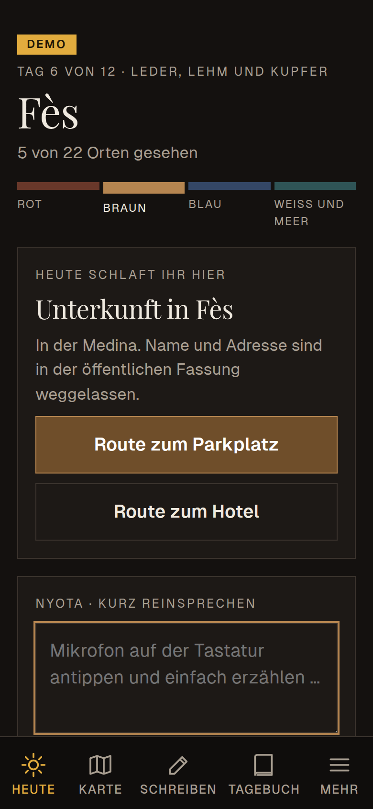
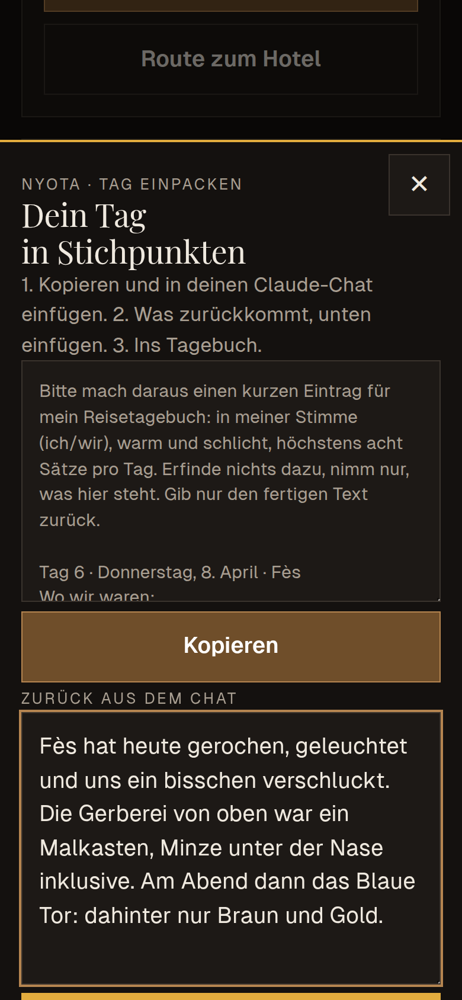
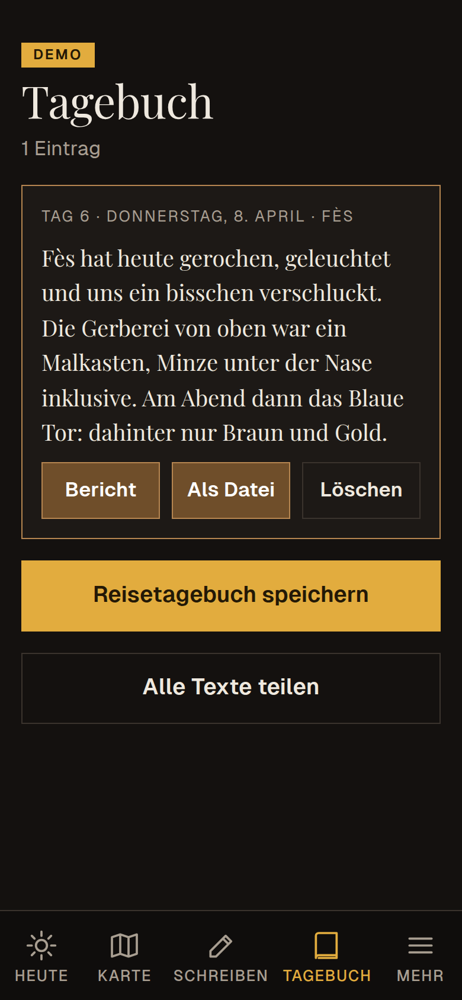

# Honig-App

**A personal travel companion for a road trip through Morocco, developed through a human-led, AI-assisted workflow.**

> **Status: work in progress.** The app works and can be tried in its demo mode. Details along the route
> are still being added, and its real test is the trip itself. This repository will be updated afterwards
> with what was learned on the road.

A web app that behaves like an installed phone app and works offline: Marrakesh, Fès, Chefchaouen and
Tangier by rental car. It shows the day at a glance, guides to the car park and the accommodation,
collects spoken notes during the day and turns them into a travel diary in the evening, without calling
any AI service from inside the app.

The interface is in German. It is built for real use on one trip, not as a demo.

  
  
  

*Screenshots from the demo mode, with a fictional sample trip.*

## What it does

| Area | What you see |
| --- | --- |
| Heute (Today) | City and day of the trip, where you sleep, route to the car park, today's light (golden and blue hour), weather, where the rental car is parked |
| Karte (Map) | About 60 researched places with short texts, best light, effort and opening hours, and practical cautions. Visited places turn gold by GPS; a misplaced point can be corrected on the spot |
| Schreiben (Write) | Choose a photo, dictate a caption, share it directly, for example to a messenger status |
| Tagebuch (Diary) | Day entries, photo captions and messages collect into a travel diary that can be saved as a single file |
| Mehr (More) | Taxi card with the address in French, euro–dirham converter, fair price guide, a few phrases in Darija |

- **Journey of colours:** the whole app takes on the colour of the current city: red, brown, blue, white and sea.
- **Messages along the way:** letters, postcards, riddles and poems that appear at certain places or on certain
  days. They are stored encrypted and can only be opened on the traveller's phone.

## How it was developed

This project was developed collaboratively: by one person who writes no code, working with several AI systems across different environments.

The way of working was a conversation, not a hand-off. Uta Kähler described what she needed, what she did not want, and what a
previous travel app had taught her. Claude proposed how it could work and contributed ideas of its own. She listened, asked back,
chose what to adopt, and set the direction for the next step.

Final responsibility stayed with her. That includes the questions nobody raises automatically: what a public repository may
reveal about a private trip, what German data protection requires, which external services a phone should contact at all.
AI systems often think along on such points, and she asks them to. Keeping these questions in view, and answering for the
result, remains the responsibility of the person whose name is on the project.

| Participant | Contribution |
| --- | --- |
| **Uta Kähler** (final responsibility) | Idea, requirements and design direction; data protection requirements; weighed the proposals and decided what to adopt; tests and acceptance |
| **Claude Code** (Anthropic) | Proposed solutions and ideas; implementation, research on places, texts in the app, iterative refinement |
| **A second Claude instance** (Anthropic) | Preparing hosting on her own website and the privacy statement |
| **Other AI instances she works with** | Contribute the encrypted messages that appear during the trip |

Uta Kähler writes no code. What this project shows is a different competence: describing clearly what is needed, engaging with
what AI systems propose, deciding what to take on, keeping several contributors working towards one coherent result, and carrying
final responsibility for it. This is responsibility for the process in AI-assisted development, not software development, and
the two are not the same.

## From requirements to use

There were no formal specification documents. Requirements came in ordinary spoken language, for example:

> *“So basically I'd rather be the one who talks. That means I probably won't be typing much.”*
> („Also, prinzipiell bin ich lieber derjenige, der spricht. Das heißt, eintippen werde ich wohl eher weniger.“)

> *“I didn't want to keep calling up fresh instances.”*
> („Ich wollte nicht immer wieder irgendwelche frischen Instanzen aufrufen.“)

The second sentence became the central design decision. A previous app had a built-in text generator that started a new AI
session for every request. The Honig-App calls no AI service at all. During the day, notes are dictated with the phone's
keyboard microphone and stored with time and nearest place. In the evening, “Tag einpacken” (“pack up the day”) turns them into
a short prompt that she pastes into the chat she is already having anyway. The text that comes back goes into the diary.
No API key, no running costs, no context lost.

> *“Everything that can be read in the code must hold up well under data protection law, especially for Germany.”*
> („Alles, was im Code lesbar ist, muss sozusagen gerade für Deutschland datenschutzrechtlich gut bestehen.“)

This set the architecture for everything personal:

- Travel dates are not in the code. They are entered once on the phone and stay there.
- Personal content is stored only encrypted (AES-GCM). The key reaches the phone via a private link, in the part of the URL
  that browsers never send to a server.
- In this public version, names and addresses of the accommodation are left out.
- No Google Fonts, no CDNs: fonts and libraries are part of the repository.
- No cookies, no tracking. Everything entered stays in the phone's browser storage.

The [Werkstattbericht](WERKSTATTBERICHT.md) (workshop report, in German with an English summary) records more of the
original requirement statements and what became of each.

## Under the hood

Plain HTML, CSS and JavaScript, no framework and no build step.

- **Offline:** a service worker keeps the app and every map tile already seen.
- **Map:** [Leaflet](https://leafletjs.com) with [OpenStreetMap](https://www.openstreetmap.org/copyright) tiles.
- **Light:** sunrise, golden and blue hour calculated on the device with [SunCalc](https://github.com/mourner/suncalc).
- **Weather:** [Open-Meteo](https://open-meteo.com), queried only with the coordinates of the city centre, never with the
  user's own location.
- **Storage:** `localStorage` for state, IndexedDB for small copies of diary photos.
- **Encryption:** Web Crypto API, AES-GCM. `werkzeug/geheim_bauen.mjs` encrypts the personal content.
- **Places:** researched places are kept as JSON in `quellen/` and assembled into `orte.js` by `werkzeug/orte_bauen.py`.
- **Demo:** append `#demo` to the address to see the app with a fictional sample trip. Nothing is saved.

## Data and licences

- Code: MIT licence; see [LICENSE](LICENSE).
- Leaflet and SunCalc: BSD 2-Clause licence; see `lib/`.
- Playfair Display and Geist: SIL Open Font License; see `fonts/`.
- Map data © OpenStreetMap contributors (ODbL). Weather data by Open-Meteo (CC BY 4.0).
